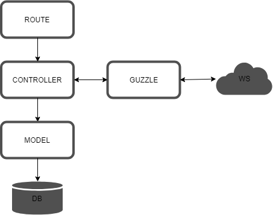
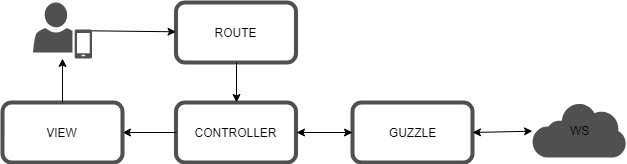

# Consumo de Servicios Web RESTful con Laravel
En esta sección se documenta la forma de consumir datos a través de servicios web RESTful con Laravel.

Es posible contar con API's públicas como la del [Ministerio de Salud](#https://api.salud.gob.sv/), en donde es posible realizar consulta sobre los principales catálogos que se utilizan en el servicio de CUN o registro de nacimientos. Al mismo tiempo es posible consultar otros catálogos de común interés para las demás instituciones como:

* Departamento
* Municipio
* Pais

## Escenarios de consulta
Para poder consumir datos de un servicio web con Laravel, es importante tener en cuenta las clases necesarias para hacer una llamada de servicio a través del protocolo HTTP.

Para php, así como para la mayoría de lenguajes de programación existen diversas librerías que facilitan el uso y consumo de servicios web RESTful, en esta guía se utilizará [Guzzle](#https://github.com/guzzle/guzzle).

Implementando Guzzle como librería que facilita la creación de cliente HTTP, se debe tomar en cuenta que otras clases se ocupar para el consumo de servicios web. 

### Consulta de servicios web
Como primer caso, se puede acceder a servicios web sin necesidad de mostrar los datos en una vista o formulario de iteración con usuarios, este caso en particular se puede ocupar para aquellas rutinas automáticas donde se necesita consultar servicios de otras instituciones para ser procesada en servicios internos o almacenarlos en base de datos locales.

<p align="center">
  
</p>

Este ejemplo por ser un caso simple, se codificará toda la estructura de llamada a servicio web con Guzzle desde el archivo de controlador (DepartamentosController.php) al final los datos obtenidos son enviados a una vista.
``` php
public function index()
{
    $client = new Client([
            'base_uri' => 'https://api.salud.gob.sv/',
            'timeout'  => 2.0
        ]);
    $response = $client->request('GET', 'departamentos',
            [
                'headers' => [
                    'Accept'     => 'application/json'
                ]
            ]
        );
    $departamentos = json_decode($response->getBody()->getContents());
    return view('departamentos.index', compact('departamentos'));
}
```
Si el objetivo fuera guardar $departamentos en una tabla usando el ORM Eloquent deberíamos tener una instrucción como la siguiente.

``` php
Departamento::create($departamentos->all());
```

### Consulta de servicios web desde formularios
El siguiente caso, se tiene un sistema con formularios web los cuales realizan llamadas a datos remotos a través de servicios web.

<p align="center">
  
</p>

El usuario realiza las operaciones de mantenimiento desde los formularios web, dependiendo de la operación realizada por el usuario la configuración interna de Laravel accede la configuración de rutas (routes.php), según la ruta definida se llama a la función definida en el controlador (ConsumoPersonasController.php) el cual realiza una instancia del cliente Guzzle para acceder a servicios remotos a través de HTTP. 

En este ejemplo y para dejar una configuración más funcional para acceder a múltiples recursos se ha definido una clase global para la creación del cliente Guzzle (GuzzleHttpRequestUtilidades.php), dicha clase se inicializa con la construcción de un nuevo cliente a quien se le asigna la URI de los recursos a acceder.

``` php
public function __construct()
{
    $this->client = new Client([
        'base_uri' => 'http://localhost:81/proveer-datos/public/',
        'timeout'  => 2.0
    ]);
}
```

En la misma clase se define método para poder obtener los datos de los servicios remotos.
``` php
protected function get($url)
{
    $response = $this->client->request('GET', $url);
    return json_decode($response->getBody()->getContents());
}
```
[Acceder al codigo completo de la clase GuzzleHttpRequestUtilidades.php](app/Utilidades/GuzzleHttpRequestUtilidades.php)


Adicional a esto, tambien se ha definido la clase PersonasGuzzleUtilidades.php que hereda de GuzzleHttpRequestUtilidades.php que es la interfaz que se accede desde  ConsumoPersonasController.php 
``` php
public function all()
{
    return $this->get('personas');
}
```
[Acceder al codigo completo de interfaz](app/Utilidades/PersonasGuzzleUtilidades.php)

Una vez se han obtenido los datos, se envían a una vista para ser representada a los usuarios. 
``` php
public function index()
{
    $datos = $this->personas->all();
    return view('personas.index', compact('datos'));
}
```
[Acceder al codigo completo de controlador](app/Http/Controllers/ConsumoPersonasController.php)

El servicio web devuelve un json con la siguiente estructura
``` json
{
    "datos": [
                {
                    "id": 1,
                    "dui": "412786227",
                    "nombre": "Joaquin",
                    "apellido": "Heidenreich",
                    "fechaNacimiento": "2014-11-02"
                },
                {
                    "id": 2,
                    "dui": "935619249",
                    "nombre": "Kris",
                    "apellido": "Bartoletti",
                    "fechaNacimiento": "1972-04-17"
                }
                …
            ]
}
```

Según la estructura de respuesta los datos de interes(Personas) están dentro de un arreglo llamado datos, para mostrar dicho resultado en una tabla con html se puede usar el siguiente código:
``` php
@foreach($datos as $dato)
    @foreach($dato as $persona)
        <tr>
            <td>
                <a href="consumopersonas/{{$persona->id}}"> 
                    {!! $persona->id !!}
                </a>
            </td>
            <td>{!! $persona->nombre !!}</td>
            <td>{!! $persona->apellido !!}</td>
            <td>{!! $persona->dui !!}</td>
            <td>{!! $persona->fechaNacimiento !!}</td>
        </tr>
    @endforeach
@endforeach

```
[Acceder al codigo completo de la vista personas.index](resources/views/personas/index.blade.php)
